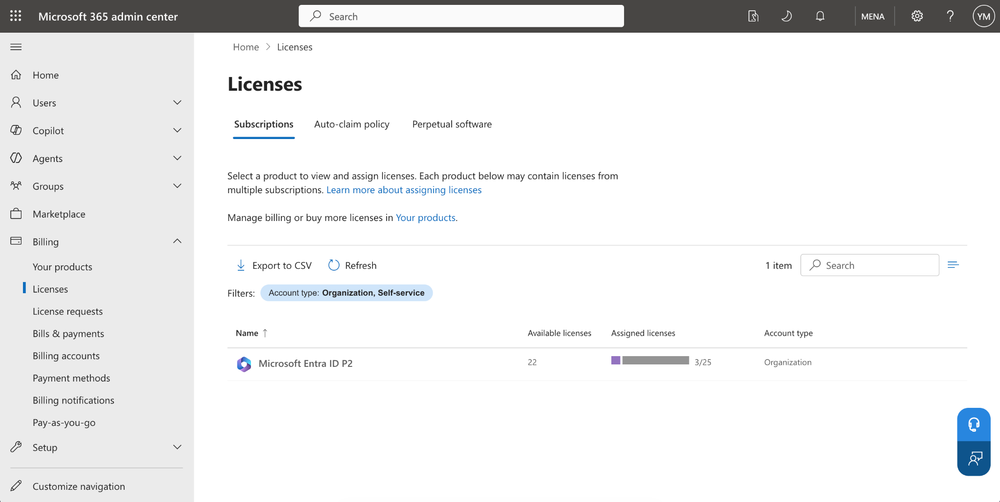
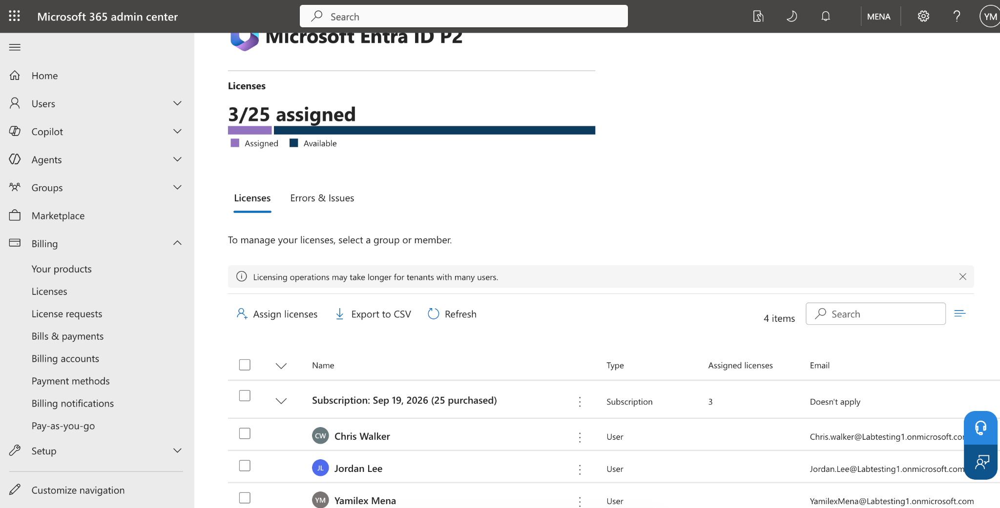
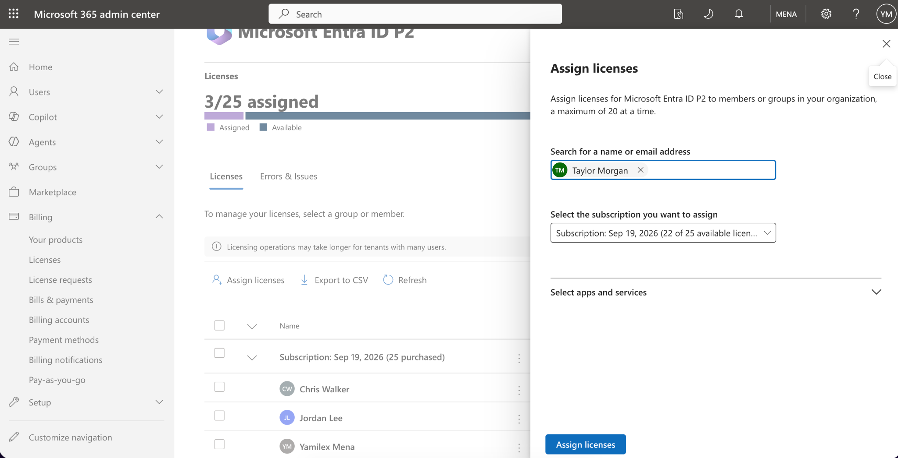
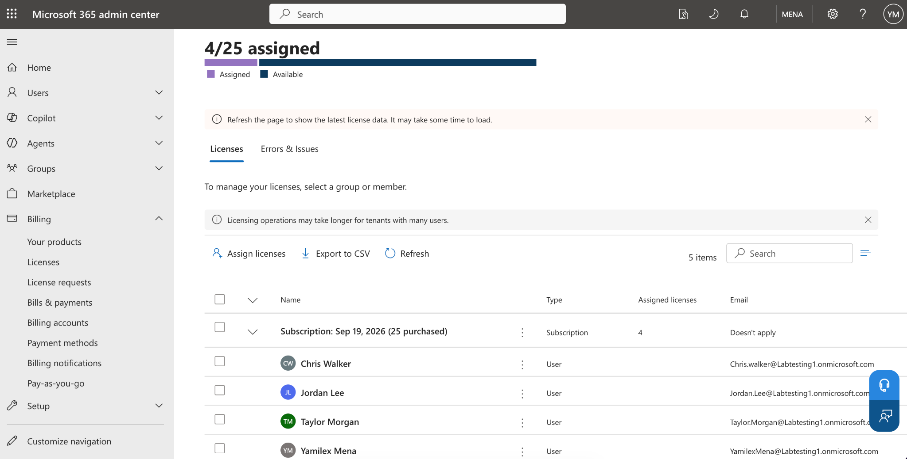
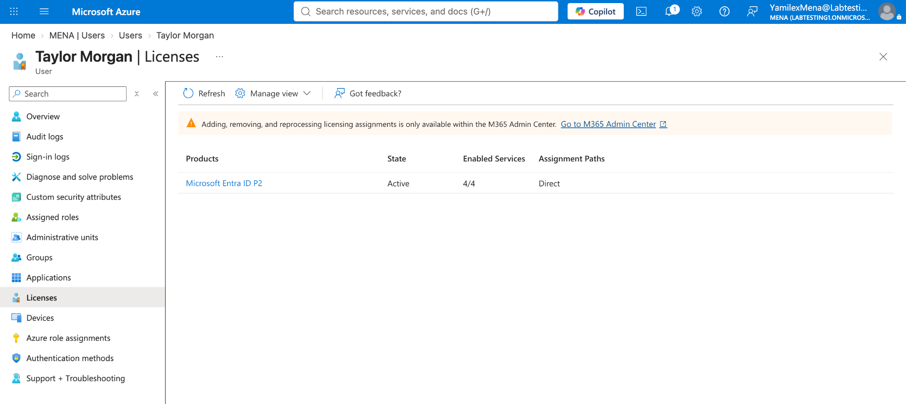

# Cloud Provisioning & Microsoft Entra ID P2 Licensing

## Objective

Assign a Microsoft Entra ID P2 license to a cloud user and verify that the license is active on the account.

## Step 1: Review Available P2 Licenses

Reviewed the available Microsoft Entra ID P2 licenses in the Microsoft 365 admin center.

## Step 2: Review Current License Assignments

Opened the P2 subscription and reviewed the users who already had licenses assigned.

## Step 3: Select a User for Licensing

Selected **Taylor Morgan** as the user who would receive the Microsoft Entra ID P2 license.

## Step 4: Confirm the License Assignment

Confirmed that Taylor Morgan appeared in the licensed user list after the assignment was completed.

## Step 5: Verify the License on the User Account

Verified that the Microsoft Entra ID P2 license was active and directly assigned to the user.

## Skills Demonstrated

- Microsoft Entra ID
- Microsoft 365 Admin Center
- User Licensing
- Cloud User Administration
- Identity and Access Management
- Account Verification
